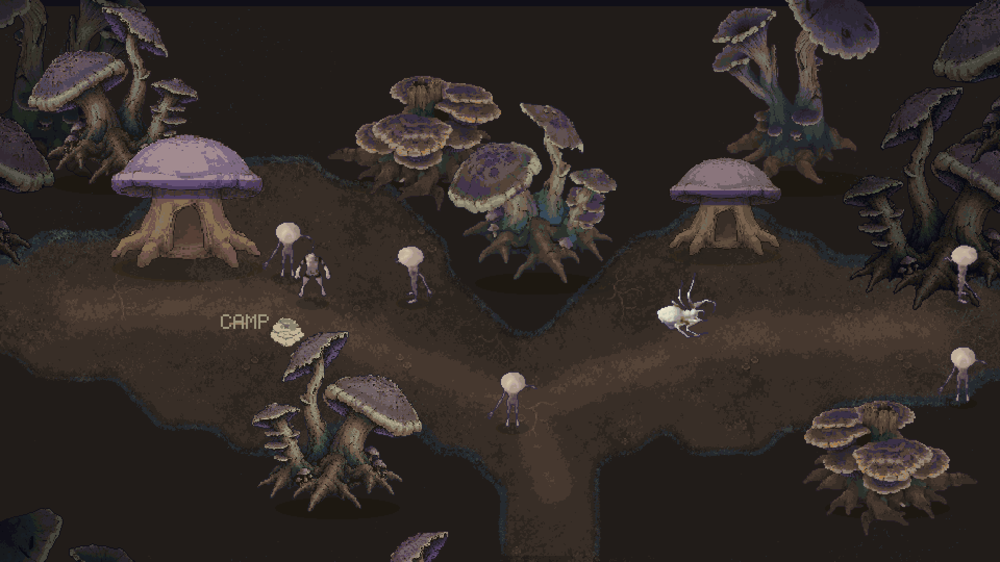
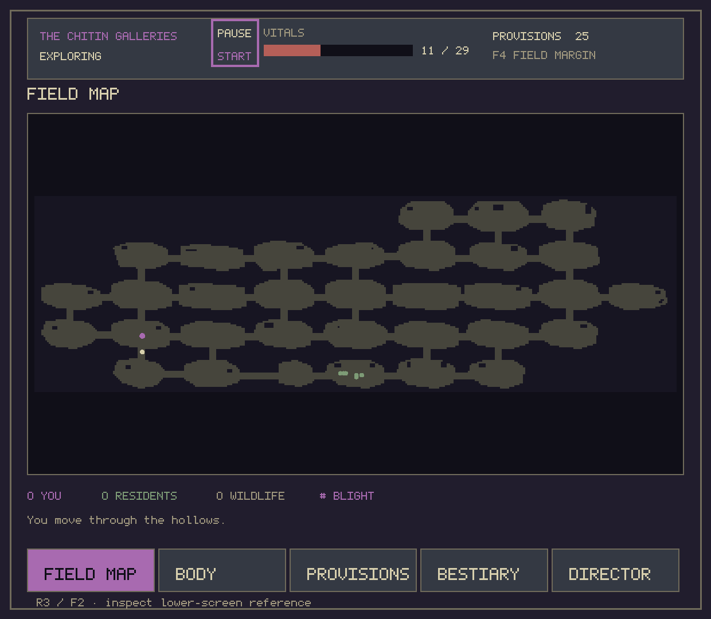
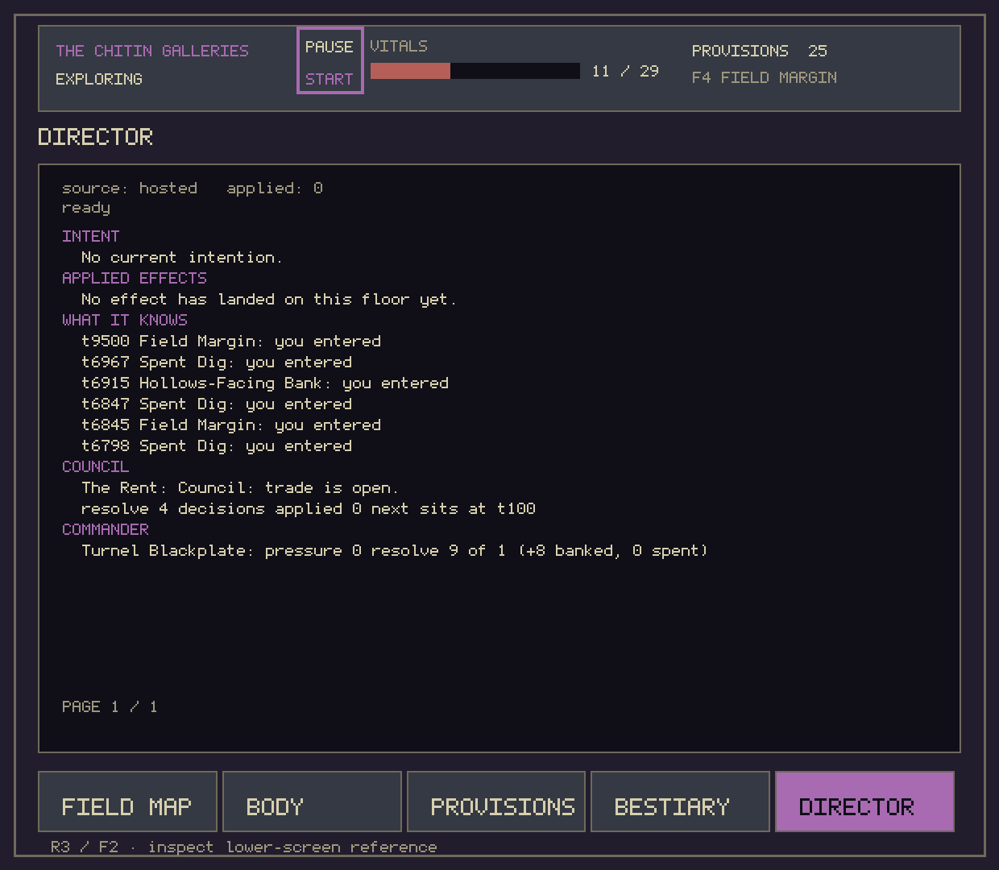
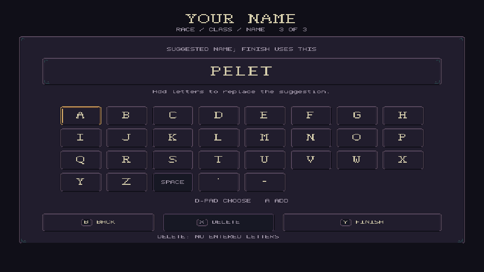
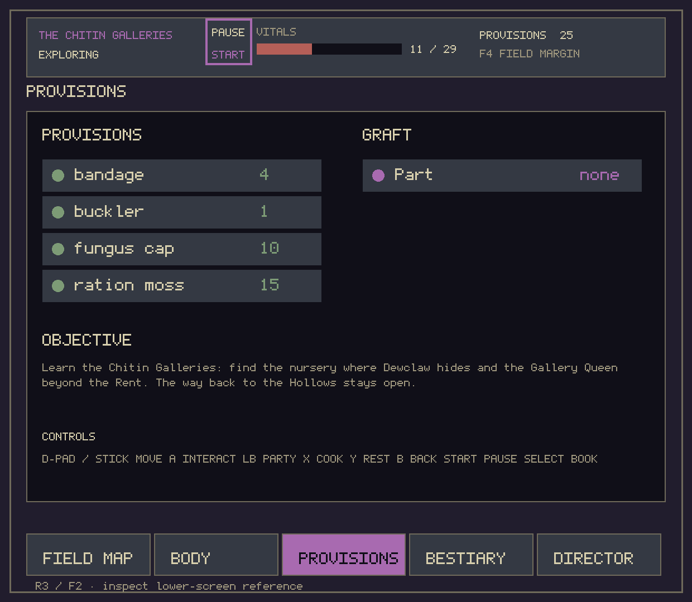

# Deepwarren

Free online co-op Android demo. The game connects to our hosted world automatically; you do not
need a GPU server, model download, VPN, or account with a model provider.

**[Download the Android APK](https://github.com/phippsrtyler/deepwarren-demo/releases/latest/download/Deepwarren.apk)** | [Windows setup](https://github.com/phippsrtyler/deepwarren-demo/releases/latest/download/Deepwarren-Windows-Setup.zip) | [Mac setup (experimental)](https://github.com/phippsrtyler/deepwarren-demo/releases/latest/download/Deepwarren-Mac-Setup.zip)

The demo allows **eight simultaneous players** in one shared world, with a waiting queue.
Current build: **0.4.0-public-demo (versionCode 10)**. Verify your download against
`Deepwarren.apk.sha256`, published with each release.
The host runs on the developer's PC and must be online; this is an early demo, not a continuously available service.

[See the demo page](https://phippsrtyler.github.io/deepwarren-demo/) — creature sprites animated
from the game's own art, the world at a glance, and a plain statement of what the demo does and does
not yet prove.

## Screenshots

Captured from this build on the demo's own virtual device. The wide frame is the world display; the
others are the lower display, which is a real second screen the launcher configures for you.

| The lower display while exploring | The Director panel mid-run |
| --- | --- |
|  |  |

| Creating a character | The in-game reference (F2) |
| --- | --- |
|  |  |

## Android / Thor

Download the APK from Releases and open it on your device. Android may ask you to allow this
download source to install applications. Keep the same installation to retain your character.
Internet access and an available host are required. When the server is full, wait in the queue;
your character is saved when you leave. Host downtime is shown separately from a full server.

## Windows and Mac

Install [Android Studio](https://developer.android.com/studio) once (no project creation needed),
then run the appropriate Deepwarren launcher supplied with the release. The launcher uses
Studio's Java runtime, downloads Google's emulator tools, asks you to review Google's SDK
licences, creates a dedicated Deepwarren virtual device, installs the APK, and starts the game.
First setup downloads several GB; subsequent launches reuse the installed tools and device.

The guided launchers are experimental; a fresh Windows installation has not been fully verified,
and macOS has not yet been verified on a physical Mac. Apple Silicon requires the ARM64 image; Intel Macs use x86_64.
See Google's [system requirements](https://developer.android.com/studio/install).

The game and menus use separate displays. The setup configures both; a second physical monitor
is not necessary. Click the lower game window for mouse/touch input. Use **WASD or arrow keys** to move/navigate, **Enter or E** to select/interact,
**Escape** to go back/pause, and **F2** for the in-game controls reference. You can also click
choices on the lower display. Click a game display first if the emulator has no keyboard focus.

### Launching the downloaded setup

Extract the whole setup ZIP before running it. On Windows, open PowerShell in the extracted
folder and run `powershell -NoProfile -ExecutionPolicy RemoteSigned -File .\Play-Deepwarren.ps1`.
This policy applies only to that process. If Windows blocks the downloaded script, review it,
then use its Properties dialog's **Unblock** checkbox before running it. Do not disable your
computer's security settings globally.

On Mac, open `Play-Deepwarren.command` in the extracted folder. If macOS asks you to review
an internet download, use Finder's **Open** action after checking its source. The launcher never
changes Gatekeeper settings. Mac instructions remain unverified on physical hardware.

Keep the Deepwarren virtual device: deleting it or clearing the app's storage removes its
installation identity, so it cannot automatically recover the same character. Re-running the
launcher updates the existing app without clearing its storage.

## Support

Report the version, device/emulator, what you expected, and what happened using this repository's
Issues page. Do not post credentials or private save files. This repository distributes the demo; it
does not contain the game's private source code. The art under `art/` is exported from the game's own
asset files so the demo page can show what the download contains; it remains the owner's property and
is not licensed for reuse or redistribution.
